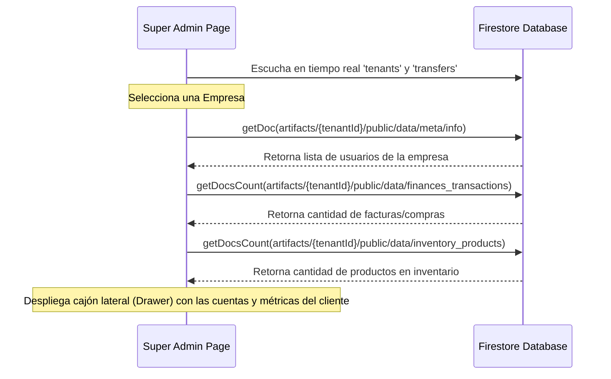

# Especificación de Diseño: Rediseño del Panel Super Admin con Sidebar y Gestión de Cuentas de Clientes

**Fecha**: 2026-06-18  
**Autor**: Antigravity  
**Tema**: Reestructuración de la interfaz Master Admin para incorporar barra de navegación lateral colapsable y cajón de detalle de consumos y usuarios por cliente.

---

## 1. Contexto y Objetivos

El administrador master (Super Admin) del ERP de WebFix necesita una interfaz robusta e intuitiva para gestionar la plataforma multi-inquilino (SaaS). Los objetivos clave de este rediseño son:
1. **Interfaz Flat-Modern**: Reemplazar las pestañas horizontales por una barra lateral colapsable (Sidebar) idéntica en comportamiento y diseño al ERP de los clientes, optimizando el espacio visual y la navegación.
2. **Control de Inquilinos (Tenants)**: Permitir al Super Admin monitorear cada empresa registrada.
3. **Gestión de Cuentas ("Cuentas de cada cliente")**: Cargar de forma dinámica la cantidad de usuarios, transacciones financieras y productos creados por cada cliente para controlar el consumo real de cada tenant.

---

## 2. Arquitectura de UI y Componentes

### 2.1 Layout General
El layout se reestructurará en una grilla de dos secciones principales:
* **Sidebar Lateral (`w-64` / `w-16`)**:
  * Implementa colapsabilidad bidireccional coordinada mediante el estado `isSidebarOpen`.
  * Integración con Lucide-React para íconos planos corporativos de alta definición.
  * Selector de Modo Oscuro/Claro integrado en la parte inferior del menú lateral.
  * Adaptabilidad responsiva para pantallas móviles (overlay deslizable con disparador hamburguesa).
* **Contenedor Principal (`flex-1 h-screen overflow-y-auto bg-slate-50 dark:bg-[#08080a]`)**:
  * Aloja la vista activa actual controlada por el estado `activeTab` ('dashboard' | 'tenants' | 'transfers' | 'plans').

### 2.2 Navegación Lateral (Sidebar Links)
* **Dashboard Global**: Resumen de MRR estimado, empresas activas, solicitudes de pago pendientes.
* **Empresas (Tenants)**: Tabla principal de inquilinos con búsqueda en tiempo real.
* **Aprobaciones SRI / Transferencias**: Aprobación de vouchers y depósitos reportados por usuarios.
* **Ajustes de Planes**: Gestión dinámica de Starter, Profesional y Enterprise.

---

## 3. Flujo de Datos y Conexión con Firestore

Para mostrar "las cuentas de cada cliente" (usuarios asociados y consumo de recursos), implementaremos consultas bajo demanda al seleccionar una empresa en la lista:

1. **Usuarios Registrados por Tenant**:
   * Ruta del documento: `artifacts/{tenantId}/public/data/meta/info`
   * Campo a leer: `users` (arreglo de objetos de usuario).
2. **Uso de Recursos del ERP (Métricas de Consumo)**:
   * **Transacciones**: `collection(db, 'artifacts', tenantId, 'public', 'data', 'finances_transactions')` (Cantidad total de documentos para medir facturación).
   * **Productos**: `collection(db, 'artifacts', tenantId, 'public', 'data', 'inventory_products')` (Cantidad total de ítems en catálogo).

---

## 4. Diseño del Cajón de Detalles (Tenant Detail Drawer)

Al hacer clic en una empresa, un panel deslizante lateral (`fixed right-0 h-full w-full max-w-lg`) mostrará:
* **Cabecera**: Razón social de la empresa, su ID de inquilino y estado de suscripción editable.
* **Métricas de Consumo**:
  * Barra de progreso comparativa entre el uso actual y el límite del plan (Usuarios creados vs. Límite de plan, Productos vs. Límite de plan).
  * Contador total de transacciones financieras registradas (facturación y egresos).
* **Sección de Cuentas de Usuario**:
  * Tabla con foto/iniciales, nombre, correo electrónico y rol en la empresa (ej. Administrador, Vendedor, Contador).
* **Ajustes de Suscripción**:
  * Selección de plan (Starter, Profesional, Enterprise).
  * Estado de cuenta (Activo, Prueba, Suspendido).
  * Selector de fecha de vencimiento.

---

## 5. Control de Errores y Seguridad

* **Control de Permisos**: La regla de seguridad de Firestore bloqueará cualquier lectura a `/tenants` o subcolecciones de `/artifacts` a menos que el usuario autenticado tenga el rol `superadmin`.
* **Manejo de Errores de Red/Permisos**: Todos los accesos se envolverán en bloques `try/catch` con `showToast` descriptivos. Si falla la lectura de un inquilino específico, se mostrará una alerta suave en el drawer sin tumbar toda la aplicación.
* **Prevención de Pérdida de Datos**: Las actualizaciones a planes no interferirán con las firmas electrónicas `.p12` o datos de facturación SRI del cliente.

---

## 6. Plan de Pruebas

### Pruebas de UI (Manuales)
1. Iniciar sesión como `aurresta@webfixsoluciones.net` y verificar que redirige al Super Admin.
2. Hacer clic en el menú hamburguesa / colapso y verificar que el ancho del sidebar se reduce suavemente y muestra iconos únicamente.
3. Abrir la pestaña **Empresas**, buscar un inquilino y hacer clic en "Ver Detalles". Validar que se abre el cajón derecho con la lista de usuarios pertenecientes a ese inquilino y las métricas de transacciones/productos.
4. Alternar entre modo oscuro y modo claro desde el sidebar de administración.

### Pruebas de Integración (Firestore)
1. Modificar el plan de una empresa de Starter a Profesional y comprobar que el ERP del cliente desbloquea los módulos de Inventario inmediatamente.
2. Modificar la fecha de vencimiento a una fecha pasada y comprobar que el ERP bloquea el acceso al cliente mostrando la pantalla de cuenta suspendida.
